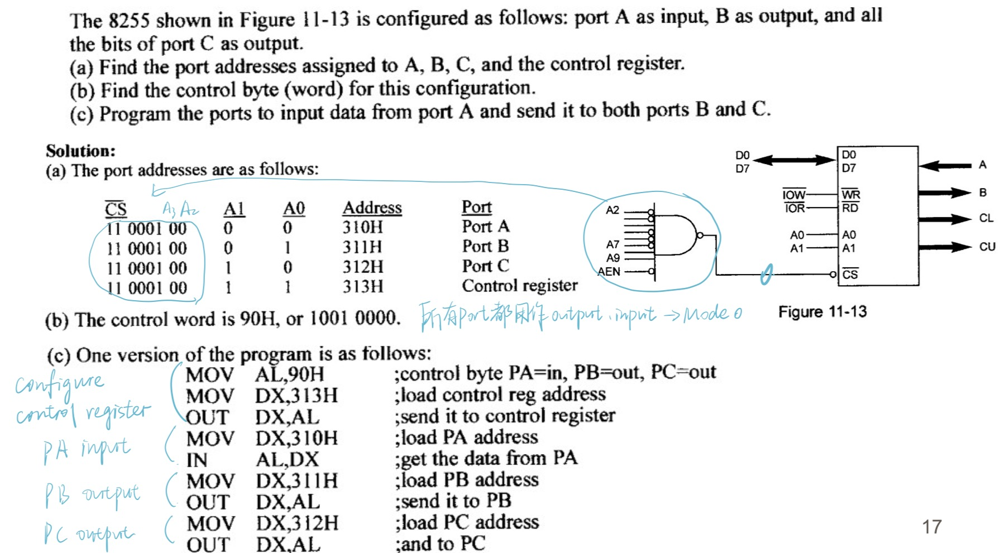

### **1.结构**
①与CPU连接：Data lines + Address lines + Control lines
②与外设连接：3个八位并行的IO接口Port A,Port B,Port C
③内部控制部分：Group A control,Group B control

### 2.引脚
①Data Bus Buffer 双向，三态(高电平，低电平，高阻态(芯片未选中))
②Read/Write control logic
RESET：clear the control register 所有port设置成input

方向：
==input：外设-->8255-->CPU==
==output：CPU-->8255-->外设==
==RD：Port(8255)-->Data Bus(CPU)==
==WR：Data Bus(CPU)-->Port(8255)==

### 3.Operation Modes
**Mode 0**：PA, PB, PC: PCU{PC==4==~PC7}, PCL{PC0~PC3}；No Handshaking
**Mode 1**：PA handshake PCU{PC==3==~PC7} ；PB handshake PCL{PC0~PC2}
**Mode 2**：PA bidirectional handshake data transfer； PCU{PC==3==~PC7} handshake

PS.1.Mode 0/1中端口要么做input要么做output，即单行道；Mode 2中Port A为双行道
2.operation mode规定了端口可以作为input port or output port，在读写操作的时候相应选择

**Bit Set/Reset (BSR) Mode**：Only PC can be used as **output** port； Each line of PC can be set/reset individually

### 4.Control Register
Selected when A1=1, A0=1
#### Mode selection word
##### ==1.Input/output modes==

PS.(不保对)Mode 2的时候由于Port A是bidirectional的，D4 arbitrary；Port C做握手信号见后面

具体使用案例：
```
MOV  AL, 10001001B
MOV  DX, ControlPort
OUT   DX, AL
```
```
MOV  AL, 10011010B
OUT   63H, AL
```
##### ==2.BSR mode==


```
MOV  AL, 00001011B  ; set PC5 high level
OUT  63H, AL
MOV  AL, 00001010B  ; set PC5 low level
OUT  63H, AL
```

PS. 二进制从0开始，要求控制第二个led灯，它对应的D3D2D1=001

### 5.1 Mode 0
Input data are not latched(数据必须一直保持在引脚上，直到CPU读取)
Output data are latched(写入后，数据会一直锁存在8255中)


### 5.2-1 Mode 1 input
Input & output latched
#### 1. Pin
PC6,7 can be used for any purpose.

|  |  |
| ----------------------------------------- | ----------------------------------------- |

| 8255pin | 信号名   | 全称                  | 方向  | 功能                         |
| ------- | ----- | ------------------- | --- | -------------------------- |
| PC4     | STBA  | Strobe Input Signal | 输入  | 外设把数据放好后,给一个选通脉冲,8255 锁存数据 |
| PC5     | IBFA  | Input Buffer Full   | 输出  | 8255 告诉外设：数据已收到,缓冲器满       |
| PC3     | INTRA | Interrupt Request   | 输出  | 向 CPU 发中断请求(如果 INTEA 允许的话) |
INTE：
由 PC4/PC2 编程（软件写 BSR 控制字）
但 INTRA/INTRB 实际使用 PC3/PC0 引脚输出 （INTE 允许时，INTR 才能工作）


Control Register的D3：PC7，PC6两个引脚的**模式**，用作input还是output
PC 的 D7、D6：PC7，PC6 这两个引脚作为“普通 I/O”时，CPU 读 PC 口所得到的**数据**

#### 2.时序逻辑
1. 外设先把数据放到 **PA0~PA7**，然后==拉低 **~STB**（选通信号）==，8255 在 STB 下降沿锁存数据到 PA 端口锁存器
2. 8255 ==拉高 IBF==（告诉外设：数据已收，但 CPU 还没取）
3. **IBF = 1**（已有数据待读）**~STB = 1**（STB 已恢复高电平，外设没在发新的）**INTEA = 1**（中断允许，由 PC4 通过 BSR 置位）    → 8255 ==拉高 **INTRA**==（PC3）：
4. CPU 响应中断，执行 `IN AL, PA_PORT`读取 PA 数据，控制信号：**~RD = 0**（读操作），8255 检测到读操作 → ==自动清除 INTRA==
5. ~RD =1（CPU 读完了）==8255 把 IBF 清 0==，外设检测到 IBF = 0，就可以发送下一个数据了

### 5.2-2 Mode 1 output
#### 1.Pin
PC4,5 can be used for any purpose.

|  |  |
| ----------------------------------------- | ----------------------------------------- |

| 8255 pin | 信号名   | 方向  | 功能                   |
| -------- | ----- | --- | -------------------- |
| PC6      | ACKA  | 输入  | 外设应答：已取走数据           |
| PC7      | OBFA  | 输出  | 告诉外设：8255 已准备好数据，快来取 |
| PC3      | INTRA | 输出  | 向 CPU 发送中断请求         |
| 内部位      | INTEA |     | 中断允许控制 (1=允许, 0=禁止)  |


#### 2.时序逻辑
CPU 响应中断 → 写数据 → 清中断 → `~OBF` 通知外设 → 外设 `~ACK` 取数据 → 清 `~OBF` → 条件满足 → 再发起中断，重复。

条件满足to be specific：
- `~OBF_A` = 高（缓冲器空）
- `~ACK_A` = 高（表示没有正在应答，应答已结束）
- `INTE_A` = 高（中断允许使能，由控制字或位操作设定）

### 5.3 Mode 2


PC0-2可以单独作为I/O
检查中断的时候看~OBF和IBF谁高处理谁

顺序：
1.判断什么mode
2.判断input or output
3.查具体的图，高or低电平有效