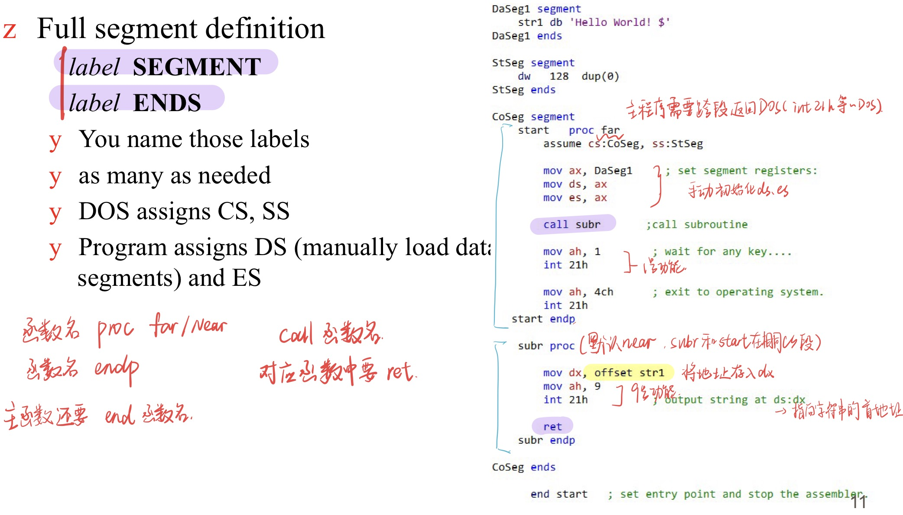

Low-level language: deals with the internal structure of a CPU
Hard to program, poor portability(可移植性) but very efficient

Assembly language instruction汇编指令--每条对应CPU中一条机器码
Directives伪指令--指导汇编器

## 语句形式Form of Statement

## Simplified Segment Definition

1. Selects the size of the memory model
SMALL: code <=64KB,  data <=64KB 单个代码段，单个数据段
MEDIUM: data <=64KB, code >64KB 单个数据段，多个代码段
COMPACT: code<=64KB, data >64KB
LARGE: data>64KB but single set of data<64KB(单个数据块，如数组), code>64KB
HUGE: data>64KB, code>64KB
TINY: code + data<64KB
2. .CODE, .DATA, .STACK
Automatically correspond to the CPU’s CS, DS, SS
DOS 磁盘操作系统 自动初始化CS,SS；==DS,ES需要手动初始化==

## Full Segment Definition
Program starts from the entrance, ends whenever calls 21H interruption with AH=4CH.

| 示意图                                      | 解释                                                                                                                                             |
| ---------------------------------------- | ---------------------------------------------------------------------------------------------------------------------------------------------- |
|   | ①编辑阶段，通过文本编辑器写代码，myfile.asm ②汇编阶段，assembler programme读取myfile.asm生成.lst列表文件，.crf交叉引用文件，.obj目标文件，包含机器码但是地址还没有确定 ③链接阶段，拼接.obj并解析外部引用，输出.exe可执行文件 |

